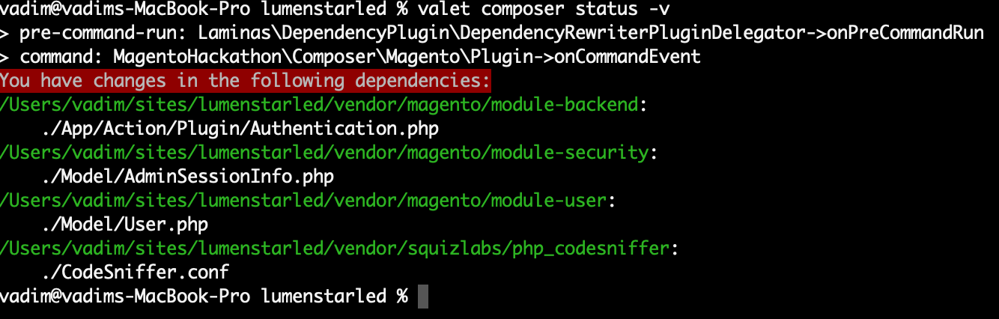

# composer
|I|I|l|l|l llII IlI|ll III|lll lIl| lIIII II|||ll IlIll| ll||l lII
III|| ||II|lI|l III Ill|l I|I| ||l||l|l ||lllI II||l| l|II| ||l|lIlII
l|l| l|| |l|ll|| Il||III IlIl lIllI ll| |IIIl| |lI |l||l||Il|
|II|II| Il|l|ll lIllIIll lll ||| lllIlI||ll lIl|I Il|IIl l||I| |ll||lIl
|II||lIlll IllI|Il ||I|I|lIlI |II|| |l|l |lIlllIII |||I|I I|l|lI l|I||I| lI|
Il||l l|lI|l||Il I|l|I|l|l lI| IIIll||Il |Ill|I IIllI|I l|l| lI|lllI|| ||I|||I|||
I|I Il|lI|lII ll||lllIlI I|II|lIlI ll||IIlII Illl|l l||I|| lIllI |III|| |ll|IllI

### Track changed files with composer
if you have to make changes to package files in the vendor folder, 
which sometimes has to be done during development or debugging, 
then this command will allow you to track which files were changed:
```shell
composer status -v
```
you will see something like this:
